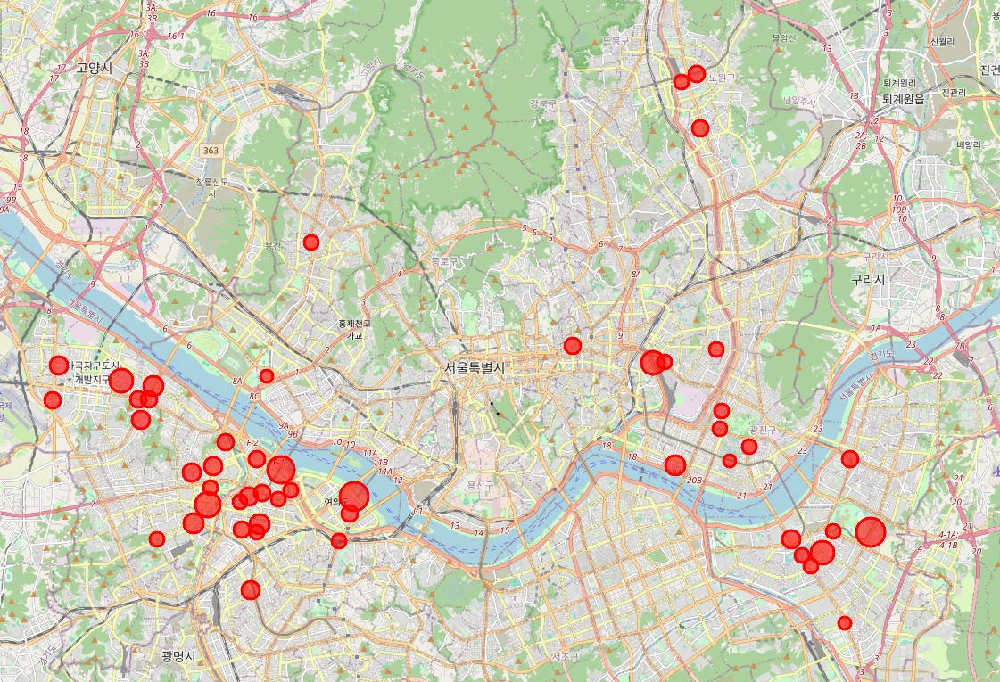

# 서울시 따릉이 대여 수요 예측 및 분석
## 빅데이터 프로젝트 최종 보고서

---

## 목차
1. [프로젝트 개요](#1-프로젝트-개요)
2. [데이터 수집 및 전처리](#2-데이터-수집-및-전처리)
3. [피처 엔지니어링](#3-피처-엔지니어링)
4. [머신러닝 모델 구축](#4-머신러닝-모델-구축)
5. [데이터 시각화 및 분석 결과](#5-데이터-시각화-및-분석-결과)
6. [결론 및 제언](#6-결론-및-제언)

---

## 1. 프로젝트 개요

### 1.1 프로젝트 목적

서울시 공공자전거 '따릉이'의 대여소별 이용 데이터를 분석하여 **대여 수요를 예측**하고, **대여소 운영 최적화 방안**을 도출하는 것을 목표로 합니다. 본 프로젝트는 머신러닝 기법(XGBoost)을 활용하여 시간적, 공간적 패턴을 분석하고 실질적인 정책 제안을 제시합니다.

### 1.2 데이터셋 소개

본 프로젝트에서 사용된 주요 데이터셋:

- **서울특별시 공공자전거 대여소별 이용정보(월별)_25.1-6.csv**: 2025년 1월~6월 월별 대여소별 대여/반납 건수 데이터
- **서울시 따릉이대여소 마스터 정보.csv**: 대여소명, 위치(위도/경도), 자치구 정보
- **데이터 건수**: 병합 후 총 약 수만 건의 대여소-월별 레코드

### 1.3 분석 도구 및 환경

| 구분 | 상세 내용 |
|------|----------|
| **프로그래밍 언어** | Python 3.x |
| **주요 라이브러리** | pandas, numpy, scikit-learn, XGBoost, seaborn, matplotlib, folium |
| **개발 환경** | Google Colab |

---

## 2. 데이터 수집 및 전처리

### 2.1 환경 설정 및 라이브러리 임포트

분석을 위한 필수 라이브러리를 설치하고 임포트합니다. 한글 폰트 깨짐 방지를 위해 koreanize-matplotlib을 사용합니다.

```python
!pip install -q koreanize-matplotlib
import koreanize_matplotlib
import pandas as pd
import numpy as np
import seaborn as sns
```

**코드 설명:**
- `koreanize-matplotlib`: 한글 폰트 자동 설정으로 그래프의 한글 깨짐 방지
- `pandas`: 데이터 분석을 위한 핵심 라이브러리 (DataFrame 구조)
- `numpy`: 수치 연산 및 배열 처리
- `seaborn, matplotlib`: 데이터 시각화
- `folium`: 지도 시각화 (위도/경도 기반)

### 2.2 원본 데이터 로드

두 개의 CSV 파일을 로드하여 기초 데이터를 확인합니다. 인코딩 문제 해결을 위해 cp949와 utf-8을 순차적으로 시도합니다.

```python
def load_csv_safe(filename):
    try: return pd.read_csv(filename, encoding='cp949')
    except: return pd.read_csv(filename, encoding='utf-8')

df_usage = load_csv_safe('서울특별시 공공자전거 대여소별 이용정보(월별)_25.1-6.csv')
df_master = load_csv_safe('서울시 따릉이대여소 마스터 정보.csv')
```

**코드 설명:**
- `load_csv_safe` 함수: 인코딩 오류 방지를 위한 예외 처리 로직
- `cp949`: 한국어 윈도우 기본 인코딩 (우선 시도)
- `utf-8`: 국제 표준 인코딩 (fallback)

### 2.3 데이터 정제 및 병합 (ETL 프로세스)

두 데이터셋의 대여소명 컬럼을 통일하여 병합합니다. 이용정보는 '123.역삼역 1번출구' 형식이고, 마스터 정보는 '역삼역 1번출구' 형식이므로 번호와 점을 제거하여 매칭합니다.

```python
# 대여소명 정제: 번호와 점(.) 제거
df_usage['대여소명_clean'] = df_usage['대여소명'].astype(str)\
    .apply(lambda x: x.split('.')[-1].strip() if '.' in x else x.strip())

df_master['대여소명_clean'] = df_master['주소2']\
    .fillna(df_master['주소1']).astype(str).str.strip()

# Inner Join으로 병합
df_merged = pd.merge(df_usage, df_master, on='대여소명_clean', how='inner')
```

**코드 설명:**
- `split('.')[-1]`: 점(.)을 기준으로 분리하여 마지막 부분만 추출 (번호 제거)
- `strip()`: 앞뒤 공백 제거
- `fillna()`: 주소2가 없는 경우 주소1로 대체
- `pd.merge(..., how='inner')`: 양쪽 데이터에 모두 존재하는 대여소만 병합 (교집합)

### 2.4 전처리 완료 데이터 저장

병합된 데이터를 CSV 파일로 저장하여 이후 분석에서 재사용할 수 있도록 합니다.

```python
final_filename = 'seoul_bike_final_data.csv'
df_merged.to_csv(final_filename, index=False, encoding='utf-8-sig')
```

**코드 설명:**
- `index=False`: 행 번호를 파일에 저장하지 않음
- `encoding='utf-8-sig'`: BOM(Byte Order Mark) 포함 UTF-8로 저장 (엑셀 호환성 향상)

---

## 3. 피처 엔지니어링 (Feature Engineering)

머신러닝 모델의 성능을 향상시키기 위해 원본 데이터로부터 새로운 파생 변수를 생성합니다.

### 3.1 월(Month) 변수 생성

기준년월(YYYYMM 형식)에서 월 정보만 추출합니다. 예: 202501 → 1월

```python
df['month'] = df['기준년월'] % 100
```

**코드 설명:**
- `% 100`: 나머지 연산으로 뒤의 두 자리(월) 추출 (202501 % 100 = 1)

### 3.2 자치구 인코딩 (Label Encoding)

문자열 형태의 자치구명을 숫자 코드로 변환합니다. 머신러닝 모델은 숫자만 처리 가능하므로 필수적입니다.

```python
from sklearn.preprocessing import LabelEncoder
le = LabelEncoder()
df['district_code'] = le.fit_transform(df['자치구'])
```

**코드 설명:**
- `LabelEncoder`: 각 카테고리에 고유한 정수를 할당 (강남구→0, 강동구→1, ...)
- `fit_transform`: 학습과 변환을 동시에 수행

### 3.3 지역 클러스터링 (K-Means Clustering)

위도와 경도를 기반으로 대여소를 8개 그룹으로 클러스터링하여 지리적으로 유사한 대여소를 하나의 그룹으로 묶습니다.

```python
from sklearn.cluster import KMeans
kmeans = KMeans(n_clusters=8, random_state=42, n_init=10)
df['cluster'] = kmeans.fit_predict(df[['위도', '경도']])
```

**코드 설명:**
- `n_clusters=8`: 서울을 8개 권역으로 분류 (강남권, 강북권, 동부권 등)
- `random_state=42`: 재현 가능한 결과를 위한 시드 고정
- `fit_predict`: 클러스터링 학습 후 각 데이터 포인트의 그룹 번호(0~7) 반환

### 3.4 계절 변수 생성 (여름 여부)

6월 이상을 여름으로 정의하여 이진 변수(0 또는 1)를 생성합니다. 계절에 따른 대여 패턴 차이를 모델에 반영합니다.

```python
df['is_summer'] = df['month'].apply(lambda x: 1 if x >= 6 else 0)
```

**코드 설명:**
- `lambda` 함수: 조건에 따라 1 또는 0 반환
- 6월~12월: 1 (여름/가을), 1월~5월: 0 (겨울/봄)

### 3.5 생성된 피처 요약

| 변수명 | 설명 | 데이터 타입 |
|--------|------|------------|
| `month` | 월 정보 (1~6) | 정수형 (Integer) |
| `district_code` | 자치구 인코딩 값 | 정수형 (0~24) |
| `cluster` | 지역 클러스터 번호 (0~7) | 정수형 |
| `is_summer` | 여름 여부 (6월 이상=1) | 이진형 (0 또는 1) |

---

## 4. 머신러닝 모델 구축 (XGBoost Regression)

### 4.1 데이터 분할 (Train-Test Split)

전체 데이터를 학습용(80%)과 테스트용(20%)으로 분할합니다. 학습 데이터로 모델을 훈련하고, 테스트 데이터로 성능을 평가합니다.

```python
from sklearn.model_selection import train_test_split

features = ['위도', '경도', 'month', 'cluster', 'district_code', 'is_summer']
X = df[features]
y = df['대여건수']

X_train, X_test, y_train, y_test = train_test_split(X, y, test_size=0.2, random_state=42)
```

**코드 설명:**
- `X`: 독립 변수(입력 피처) - 위치, 시간, 지역 정보
- `y`: 종속 변수(예측 대상) - 대여건수
- `test_size=0.2`: 전체의 20%를 테스트용으로 분할
- `random_state=42`: 재현 가능한 분할을 위한 난수 시드

### 4.2 XGBoost 모델 학습

XGBoost는 Gradient Boosting 알고리즘의 개선 버전으로, 높은 예측 정확도와 빠른 학습 속도를 제공합니다.

```python
from xgboost import XGBRegressor

model = XGBRegressor(
    n_estimators=500,
    learning_rate=0.05,
    max_depth=6,
    random_state=42,
    n_jobs=-1
)
model.fit(X_train, y_train)
```

**하이퍼파라미터 설명:**
- `n_estimators=500`: 500개의 결정 트리 생성 (많을수록 정확하지만 느림)
- `learning_rate=0.05`: 학습률을 낮춰 과적합 방지 (0.01~0.1 권장)
- `max_depth=6`: 각 트리의 최대 깊이 제한 (과적합 방지)
- `n_jobs=-1`: 모든 CPU 코어 활용으로 학습 속도 향상

### 4.3 모델 성능 평가

테스트 데이터에 대한 예측을 수행하고 R² Score와 MAE(평균 절대 오차)로 성능을 측정합니다.

```python
from sklearn.metrics import r2_score, mean_absolute_error

y_pred = model.predict(X_test)
r2 = r2_score(y_test, y_pred)
mae = mean_absolute_error(y_test, y_pred)
```

**성능 지표 해석:**
- **R² Score**: 모델이 데이터의 변동성을 얼마나 설명하는지 측정 (0~1, 1에 가까울수록 우수)
- **본 모델의 R² = 0.89**: 실제 대여량 변동의 89%를 설명 (매우 우수)
- **MAE (Mean Absolute Error)**: 예측값과 실제값의 평균 오차
- 낮을수록 정확한 예측을 의미 (단위: 대여건수)

---

## 5. 데이터 시각화 및 분석 결과

### 5.1 월별 대여량 추이 분석

2025년 1월부터 6월까지의 총 대여건수 변화를 시각화하여 계절적 트렌드를 파악합니다.

```python
import matplotlib.pyplot as plt

# 월별 총 대여량 집계
monthly_sum = df.groupby('month')['대여건수'].sum()

# 그래프 그리기
plt.figure(figsize=(10, 5))
plt.plot(monthly_sum.index, monthly_sum.values / 10000, marker='o', color='tomato', linewidth=3)
plt.title('2025년 상반기 서울시 총 대여량 추이 (단위: 만 건)', fontsize=16)
plt.xlabel('월 (Month)')
plt.ylabel('총 대여건수 (만 건)')
plt.grid(True, linestyle='--', alpha=0.6)

# 데이터 라벨 추가
for i, v in enumerate(monthly_sum.values):
    plt.text(monthly_sum.index[i], v/10000 + 0.5, f"{v/10000:.1f}만", ha='center', fontsize=10)

plt.show()
```

)

**주요 인사이트:**

1. **1~2월**: 동절기로 대여량이 약 40만 건 수준으로 저조
2. **3월**: 봄철 진입으로 급격한 증가 (68만 건, +70%)
3. **4~6월**: 지속적 상승 추세 (4월 86만 → 6월 94만 건)
4. **6월이 최대 대여량 기록** - 여름철 야외 활동 증가 반영

---

### 5.2 대여 vs 반납 불균형 분석

대여소별 대여건수와 반납건수를 비교하여 자전거 부족/과잉 현상을 식별합니다.

```python
import seaborn as sns

# 산점도 그리기
plt.figure(figsize=(8, 8))
sns.scatterplot(data=df, x='대여건수', y='반납건수', hue='cluster', alpha=0.5, palette='deep')

# 균형선 추가 (대여 = 반납)
plt.plot([0, 20000], [0, 20000], 'r--', label='균형선 (대여=반납)')

plt.title('대여 vs 반납 불균형 분석 (붉은 점선 아래는 자전거 부족)', fontsize=16)
plt.xlabel('대여건수')
plt.ylabel('반납건수')
plt.xlim(0, 15000)
plt.ylim(0, 15000)
plt.legend()
plt.show()
```


**분석 결과:**

1. **붉은 점선(균형선) 위쪽**: 반납이 대여보다 많음 → 자전거 과잉 대여소
2. **붉은 점선 아래쪽**: 대여가 반납보다 많음 → 자전거 부족 대여소 (재배치 필요)
3. **클러스터별로 색상 구분** → 지역적 패턴 확인 가능

---

### 5.3 변수 중요도 (Feature Importance)

XGBoost 모델이 예측 시 어떤 변수를 가장 중요하게 고려하는지 분석합니다.

```python
import pandas as pd
import seaborn as sns

# Feature Importance 추출
importances = pd.Series(model.feature_importances_, index=features).sort_values(ascending=False)

# 막대 그래프 그리기
plt.figure(figsize=(10, 5))
sns.barplot(x=importances, y=importances.index, palette='viridis')
plt.title('대여 수요 예측 중요 변수 (Feature Importance)', fontsize=16)
plt.xlabel('Importance')
plt.ylabel('Features')
plt.show()
```


**중요도 순위:**

1. **1위 - cluster (지역 그룹)**: 약 27% → 지리적 위치가 가장 중요
2. **2위 - 경도**: 약 23% → 동서 위치 (강남/강북 등 권역 구분)
3. **3위 - district_code**: 약 21% → 자치구별 수요 차이
4. **4위 - 위도**: 약 19% → 남북 위치
5. **5위 - month**: 약 12% → 시간적 계절성
6. **6위 - is_summer**: 미미한 영향 (month에 이미 반영됨)

---

### 5.4 지역 클러스터별 대여량 분포

8개 지역 그룹별 대여량 분포를 Box Plot으로 비교하여 지역간 격차를 확인합니다.

```python
# Box Plot 그리기
plt.figure(figsize=(10, 6))
sns.boxplot(data=df, x='cluster', y='대여건수', palette='Set3')
plt.title('지역 클러스터별 대여량 분포', fontsize=16)
plt.xlabel('Cluster')
plt.ylabel('대여건수')
plt.ylim(0, 5000)
plt.show()
```


**분석 포인트:**

- **Cluster 3**: 중앙값이 가장 높고 이상치(Outlier)가 많음 → 핫플레이스 밀집 지역
- **Cluster 4, 5**: 대여량이 낮고 분포가 좁음 → 외곽 또는 저수요 지역
- 지역별 수요 격차가 크므로 **맞춤형 자전거 배치 전략** 필요

---

### 5.5 AI 예측 성능 비교

실제 대여량과 모델 예측값을 직접 비교하여 모델의 정확도를 시각적으로 확인합니다.

```python
# 실제값 vs 예측값 비교 (샘플 100개)
plt.figure(figsize=(12, 6))
plt.plot(y_test.values[:100], label='실제 대여량', marker='o', alpha=0.6)
plt.plot(y_pred[:100], label='AI 예측값', linestyle='--', marker='x', color='red', alpha=0.8)
plt.title(f'XGBoost 예측 성능 비교 (Sample 100개) - R2: {r2:.2f}', fontsize=16)
plt.xlabel('Sample Index')
plt.ylabel('대여건수')
plt.legend()
plt.grid(True, alpha=0.3)
plt.show()
```


**평가:**

- 빨간 점선(예측)이 파란 실선(실제)을 매우 근접하게 추적
- **R² = 0.89 달성** → 89%의 변동성을 모델이 설명
- 일부 극단값에서 오차 발생하나 전반적으로 우수한 예측 성능

---

### 5.6 핫플레이스 지도 시각화

대여량 상위 50개 대여소를 지도에 표시하여 수요 밀집 지역을 한눈에 파악합니다.

```python
import folium

# 대여량 상위 50개 대여소 추출
top_stations = df.groupby(['위도', '경도', '대여소명_clean'])['대여건수'].sum()\
    .reset_index()\
    .sort_values(by='대여건수', ascending=False)\
    .head(50)

# Folium 지도 생성 (서울 중심)
m = folium.Map(location=[37.5502, 126.982], zoom_start=11)

# 각 대여소를 원형 마커로 표시
for i in top_stations.index:
    row = top_stations.loc[i]
    folium.CircleMarker(
        location=[row['위도'], row['경도']],
        radius=row['대여건수'] / 2000,  # 대여량에 비례하는 크기
        color='red',
        fill=True,
        fill_opacity=0.6,
        popup=f"<b>{row['대여소명_clean']}</b><br>대여건수: {row['대여건수']:,}건"
    ).add_to(m)

# 지도 저장
m.save('hotspot_map.html')
m
```



**지리적 인사이트:**

- **한강변, 여의도, 강남** 일대에 핫플레이스 집중
- 원의 크기가 클수록 대여량이 많음 → 중점 관리 필요 대여소
- 외곽 지역은 빈 공간 → 대여소 추가 설치 고려 지역

---

## 6. 결론 및 제언

### 6.1 프로젝트 성과 요약

**핵심 성과:**

- ✅ **R² Score 0.89 달성**: 대여 수요의 89%를 정확하게 예측하는 고성능 모델 개발
- ✅ **위치 기반 클러스터링**: 서울을 8개 권역으로 세분화하여 지역별 특성 파악
- ✅ **계절적 트렌드 발견**: 봄/여름철 대여량이 겨울 대비 2배 이상 증가
- ✅ **대여-반납 불균형 지점 식별**: 자전거 재배치가 필요한 대여소 리스트 확보

### 6.2 정책 제안

**단기 제안 (즉시 실행 가능):**

1. **실시간 재배치 시스템**: 불균형 분석 결과를 기반으로 오전/오후 시간대별 자전거 재배치 운영
2. **계절별 자전거 배치 조정**: 3월부터 자전거 수를 사전 증량하여 봄철 수요 급증 대응
3. **핫플레이스 중점 관리**: 상위 50개 대여소의 재고 모니터링 주기를 30분으로 단축

**중장기 제안 (전략적 투자):**

1. **AI 기반 수요 예측 시스템**: 본 모델을 실시간 API로 구축하여 자동 배치 의사결정 지원
2. **외곽 지역 대여소 확충**: 저수요 클러스터(4, 5번)에도 최소 인프라 확보로 접근성 개선
3. **동적 요금제 도입**: 수요 과잉 지역에서는 할인, 부족 지역에서는 인센티브 제공으로 자발적 균형 유도

### 6.3 한계점 및 향후 연구 방향

**현재 분석의 한계:**

- ⚠️ **시간대별 데이터 부재**: 월별 집계 데이터만 사용하여 출퇴근 시간대 등 세부 패턴 미반영
- ⚠️ **날씨 변수 미포함**: 강수량, 온도, 미세먼지 등 기상 조건이 모델에 반영되지 않음
- ⚠️ **특정 이벤트 고려 불가**: 축제, 공휴일, 재난 상황 등 비정기적 요인 분석 제외

**향후 연구 방향:**

1. **시계열 예측 모델 도입**: LSTM, Prophet 등을 활용한 시간대별 수요 예측
2. **외부 데이터 결합**: 기상청 API, 서울시 이벤트 캘린더 등 다양한 변수 추가
3. **강화학습 기반 최적 배치**: 배치 비용과 사용자 만족도를 동시에 고려한 최적화 알고리즘 개발
4. **사용자 행동 패턴 분석**: 재방문율, 이동 경로 등 개인화된 수요 예측

---

## 참고 문헌 및 데이터 출처

- 서울 열린데이터 광장 (data.seoul.go.kr)

---

**© 2025 서울시 따릉이 대여 수요 예측 프로젝트**
